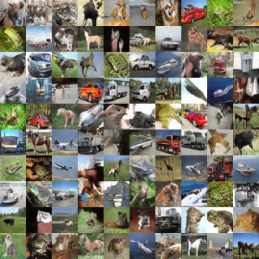
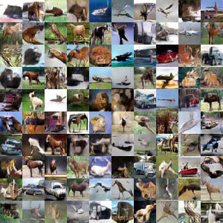
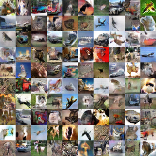
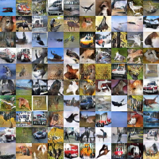
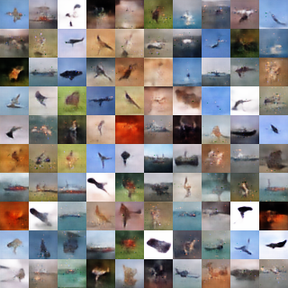

# Chainer-GAN-lib
This repository collects chainer implementation of state-of-the-art GAN algorithms.  
These codes are evaluated with the _inception score_ on Cifar-10 dataset.  
Note that our codes are not faithful re-implementation of the original paper.

How to use
-------

Install the requirements first:
```
pip install -r requirements.txt
```
This implementation has been tested with the following versions.
```
python 3.5.2
chainer 4.0.0
cupy 3.0.0
tensorflow 1.2.0 # only for downloading inception model
numpy 1.11.1
```
Download the inception score module forked from [https://github.com/hvy/chainer-inception-score](https://github.com/hvy/chainer-inception-score).
```
git submodule update -i
```
Download the inception model.
```
cd common/inception
python download.py --outfile inception_score.model
```
You can start training with `train.py`.

`python train.py --gpu 0 --algorithm dcgan --out result_dcgan`

Please see `example.sh` to train other algorithms.

Quantitative evaluation
-------

| | [Inception](https://arxiv.org/abs/1606.03498) | Inception (Official) | [FID](https://arxiv.org/abs/1706.08500) |
| ------------- | ------------- | ------------- | ------------- |
| Real data  | 12.0 | 11.24 | 3.2 (train vs test) |
| [Progressive](http://research.nvidia.com/publication/2017-10_Progressive-Growing-of)  | 8.8 | 8.54 | 19.1 |
| [SN-DCGAN](https://drive.google.com/file/d/0B8HZ50DPgR3eSVV6YlF3XzQxSjQ/view?usp=sharing)  | 7.5 | 7.41 | 23.6 |
| [WGAN-GP](https://arxiv.org/abs/1704.00028)  | 6.8 | 7.86 (ResNet) | 28.2 |
| [DFM](https://openreview.net/pdf?id=S1X7nhsxl)  | 7.3 | 7.72 | 30.1 |
| [Cramer GAN](https://arxiv.org/abs/1705.10743) | 6.4 | - | 32.7 |
| [DRAGAN](https://arxiv.org/abs/1705.07215)  | 7.1 | 6.90 | 31.5 | 
| [DCGAN-vanilla](https://arxiv.org/abs/1511.06434) | 6.7 | 6.16 [WGAN2] 6.99 [DRAGAN] | 34.3 |
| [minibatch discrimination](https://arxiv.org/abs/1606.03498)  | 7.0 | 6.86 (-L+HA) | 31.3 |
| [BEGAN](https://arxiv.org/abs/1703.10717)  | 5.4 | 5.62 | 84.0 |

Inception scores are calculated by average of 10 evaluation with 5000 samples.

FIDs are calculated with 50000 train dataset and 10000 generated samples.

Generated images
-------

- Progressive



- SN-DCGAN


- WGAN-GP


- DFM



- Cramer GAN



- DRAGAN


- DCGAN



- Minibatch discrimination


- BEGAN



License
-------
MIT License. Please see the LICENSE file for details.
